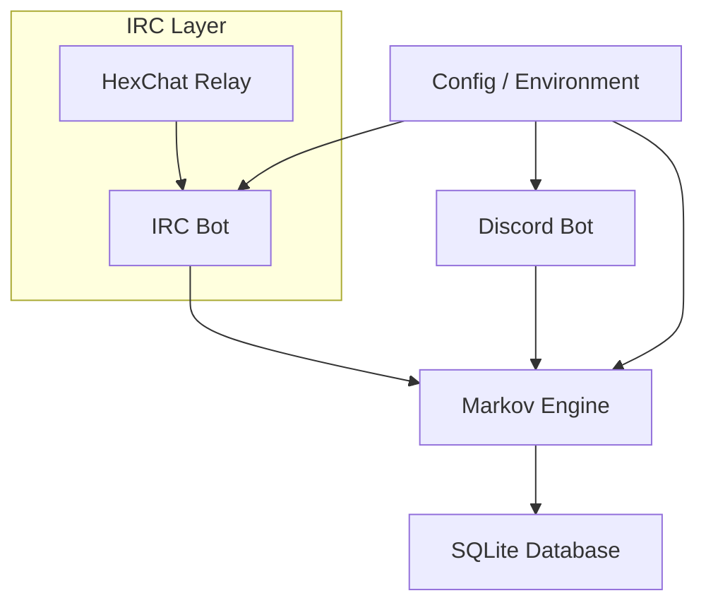

# MarkovBot

MarkovBot is a chat bot that uses Markov chains to generate text responses. It supports both IRC and Discord, and also includes an optional HexChat relay script for relaying messages between HexChat and the bot.

## Features

- Markov chain-based text generation
- Supports IRC and Discord
- SQLite database for message storage
- Configurable via JSON and environment variables
- Optional HexChat relay script

## Project Architecture



## Getting Started

### Prerequisites

- Node.js (v18+ recommended)
- npm

### Installation

```sh
npm install
```

### Build

```sh
npm run build
```

### Configuration

Copy `config.example.json` to `config.json` and edit as needed:

```sh
cp config.example.json config.json
```

- `server`, `port`, `tls`, `nick`, `channels`: IRC connection details
- `replyProbability`, `maxResponseWords`, `markovOrder`: Bot behavior
- `dbPath`: SQLite database file
- Discord: Set `discordToken`, `discordClientId`, `discordGuildIds`, `discordChannels`

You can also use environment variables (see `src/config.ts`).

### Running the Bot

#### Development (TypeScript)

```sh
npm run dev
```

#### Production

```sh
npm run build
npm start
```

### Stopping the Bot

The bot shuts down gracefully on:

- **`Ctrl+C`** (SIGINT) — when running in the terminal
- **`kill <PID>`** (SIGTERM) — from a process manager or another terminal

On shutdown, all bot connectors (IRC and Discord) are stopped and the database is closed cleanly.

## Usage

- The bot will join configured IRC channels and/or Discord servers.
- It learns from messages and generates responses based on Markov chains.
- Discord slash commands: `/markov`, `/markov-status`

## Optional: HexChat Relay

- Use `hexchat-bridge.lua` to relay messages between HexChat and the bot.
- See comments in the script for setup.

## License

ISC
